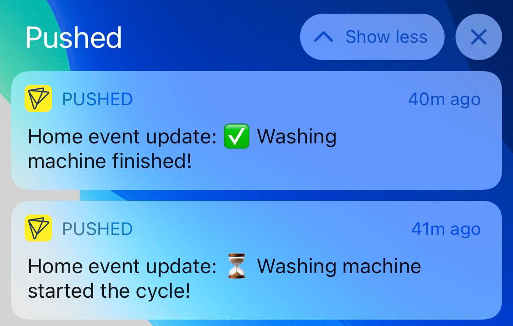

<p align="center">


</p>



# Homebridge Tuya Laundry Notify

Homebridge plugin that lets you setup push notifications for your laundry appliances using Tuya smart plug with voltage meter.

# Installation

Install this plugin using `npm i -g homebridge-tuya-laundry-notify`.

# Configuration

The plugin does not expose any new home devices. It uses homebridge as a convenient place for configuration.

## Smart Plug

Any smart plug that support live voltage/power display in Tuya app should work, in theory. The only difference between plugs is Power Value Id - property id with live power consumption on the device.

### Getting device ID and Key

There's a standard approach to get your Tuya device ID and Key, there's a bunch of manuals around Github, I used [this](https://www.youtube.com/watch?v=oq0JL_wicKg&t=522s) video. 

### Identifying Power Value ID

This plugin comes with a little CLI tool that helps you identify Power Value ID.

Install the plugin globally on your machine and run:

```bash
tuya-laundry identify --id <device_id> --key <device_key>
```

Make sure you have an appliance plugged into the smart plug and have it running. The tool will output live changes in properties and their values. On of them will be Power Value.

<!-- TODO: put example console output here -->

### Monitoring Power Consumption

Once you figure out the Power Value Id you need to figure out actual value of your appliance when it's operating/finished. 

There's a second command you can use for that:

```bash
tuya-laundry track --id <device_id> --key <device_key> --pid <power_value_id> [--margin <margin_value>]
```

Run the above command and use the appliance as you normally would - start the washing cycle and wait till it fully finished. The tool will output changes in power values and timestamps to the console. You can use `--margin` option to minimize spam in the out. Margin value is minimum percentage of the power value change that will trigger the output (e.g. `--margin 5` means it will only output new power value if the change was more than 5%).

<!-- TODO: put example console output here -->

## Pushed.co

The plugin uses pushed.co service as a free (at the time of writing) and straightforward way to receive push on you devices.  

You need to install https://pushed.co app on your phone, as well as create developer account with an app and a channel.

Pushed.co configuration roughly goes like that:

1. Create pushed.co account
2. Switch account type to Developer account
3. Create an app
4. Create a channel
5. Install the pushed.co app on your device
6. Scan channel QR code to link it with your device
7. Make a note of app key, app secret and channel alias for the configuration below

## Homebridge config

The example below contains comments, clean valid JSON version is here: [example/config.json](example/config.json) 

```json5
{
  ...
  "platforms": [
    ...
    /* The block you need to enable this plugin */
    {
      "platform": "TuyaLaundryNotify",
      "pushed": {
        "appKey": "tza3srI1qfDXaXEHdmYK",
        "appSecret": "D814ZyxzevlLiEv5ZS4eegdzZG3jeYytALtFrtTeHOQ26NFEvWs1kCL3jxiGbHZu",
        "channelAlias": "VFx7uM"
      },
      "laundryDevices": [
        /* The block you need for each appliance */
        {
          // name is used for better logging
          "name": "Washing Machine",
          // Tuya smart plug id
          "id": "424714575001911ed8d2",
          // Tuya smart plug key
          "key": "0a1f7b13a649766d",
          // use tuya-laundry identify to find out the id
          "powerValueId": "19",
          // start power value that marks appliance active mode (greater or equal) 
          "startValue": 20000,
          // how many seconds start value should hold to mark appliance active mode 
          "startDuration": 30,
          // end power value that marks appliance finishing cycle (less or equal) 
          "endValue": 300,
          // how many seconds end value should hold to mark appliance finished
          "endDuration": 30,
          // optional start message, omit if you don't want to be notified
          "startMessage": "⏳ Washing machine started the cycle!",
          // optional start message, omit if you don't want to be notified 
          "endMessage": "✅ Washing machine finished!",
          // exposes a dummy switch that will indicate if the appliance is running
          "exposeStateSwitch": true
        }
      ]
    }
    /* End of the block needed to enable this plugin */
  ]
  ...
}
```

You may add as many devices as you want, but make sure you're not exceeding Pushed.co push limits, at the time of writing it was 1000 a month for free.